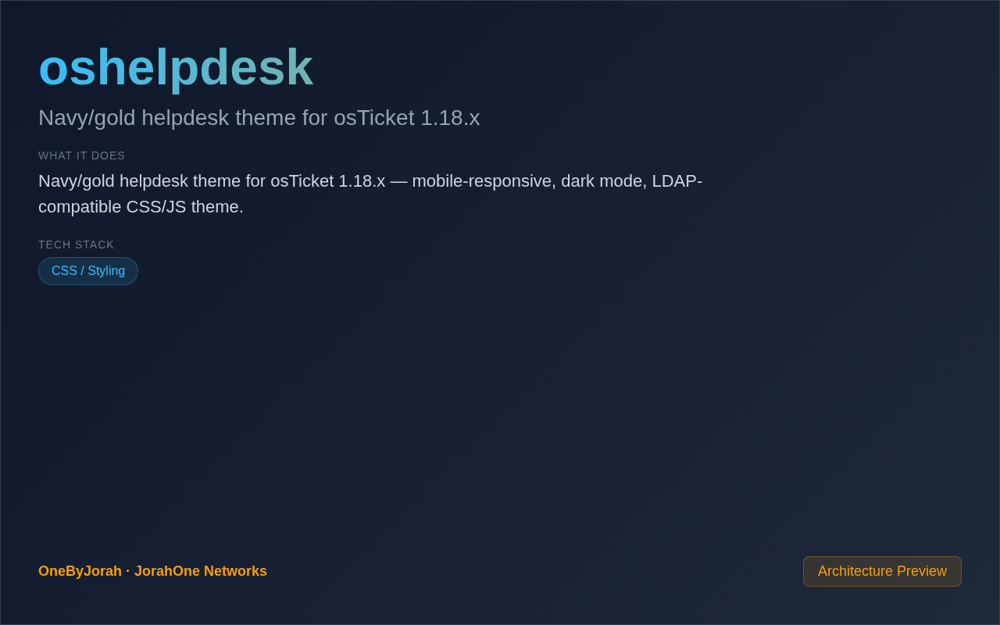

<div align="center">


# oshelpdesk

Navy/gold helpdesk theme for osTicket 1.18.x


</div>

---

<p align="center">
  
</p>

<br>

---

## Features

- **Navy/Gold Theme** — Professional color scheme for helpdesk operators.
- **Dark Mode** — Easy-on-the-eyes dark theme option.
- **Mobile Responsive** — Fully responsive design for mobile devices.
- **LDAP Compatible** — Works with LDAP/Active Directory authentication.
- **No Backend Changes** — CSS/JS only, no PHP modifications needed.
- **osTicket 1.18.x** — Tested with osTicket 1.18.x releases.
- **Custom Agent Panel** — Enhanced operator interface.
- **Ticket Filters** — Visual ticket status indicators.

## Quick Start

1. **Backup your osTicket installation**

2. **Download the theme**
   ```bash
   git clone https://github.com/OneByJorah/oshelpdesk.git
   ```

3. **Copy theme files**
   ```bash
   cp -r oshelpdesk/css/* /path/to/osticket/include/client/css/
   cp -r oshelpdesk/js/* /path/to/osticket/include/client/js/
   cp -r oshelpdesk/images/* /path/to/osticket/images/
   ```

4. **Update osTicket configuration**
   - Edit `include/ost-config.php`
   - Set `$CFG->style = 'oshelpdesk';`

5. **Clear browser cache and refresh**

## File Structure

```
oshelpdesk/
├── css/
│   ├── oshelpdesk.css       # Main theme stylesheet
│   ├── dark-mode.css        # Dark mode overrides
│   └── responsive.css       # Mobile responsive styles
├── js/
│   ├── oshelpdesk.js        # Theme JavaScript
│   └── dark-toggle.js       # Dark mode toggle
├── images/
│   ├── logo.png             # Helpdesk logo
│   └── favicon.ico          # Browser tab icon
└── README.md
```

## Customization

### Color Variables

Edit `css/oshelpdesk.css` to customize:

```css
:root {
    --navy-primary: #1a237e;
    --navy-secondary: #283593;
    --gold-primary: #ffb300;
    --gold-secondary: #ffc107;
}
```

### Logo Replacement

Replace `images/logo.png` with your own logo (recommended size: 200x50px).

## Compatibility

| osTicket Version | Status |
|------------------|--------|
| 1.18.x | ✅ Fully supported |
| 1.17.x | ⚠️ Partial support |
| 1.16.x | ❌ Not tested |

## Contributing

Contributions are welcome. Please see [CONTRIBUTING.md](CONTRIBUTING.md) for guidelines and [CODE_OF_CONDUCT.md](CODE_OF_CONDUCT.md) for community standards.

## Security

For security concerns, see [SECURITY.md](SECURITY.md). Please report vulnerabilities to **info@jorahone.com** — do not use public issues.

## License

MIT © Jhonattan L. Jimenez

---

## 🤝 Contributing

See [CONTRIBUTING.md](CONTRIBUTING.md). All contributions follow the [Code of Conduct](CODE_OF_CONDUCT.md).

## 🔒 Security

Found a vulnerability? Please follow our [Security Policy](SECURITY.md) and report privately to `security@jorahone.com`.

## 📄 License

[Other](LICENSE) © Jhonattan L. Jimenez (OneByJorah)

---

<p align="center">Built with 🌴 by <a href="https://github.com/OneByJorah">OneByJorah</a> · <a href="https://jorahone.com">jorahone.com</a></p>
